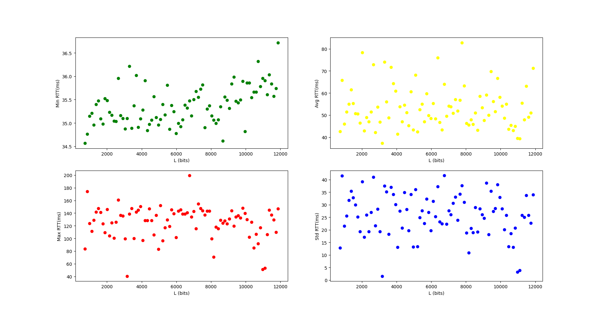

## Project choises

The project contains two main folders:

- 'src' folder for all the source code.
- 'output' folder for _.txt_ files that contains the **ping** command output for each ip address inserted in the program.

## NetPerf

This project is written in python because this language provides useful modules such as matplotlib, numpy and pingparsing. These modules are used to manage charts, arrays and to parse the output of the ping command. _NetPerf_ is compatible with both Linux and Windows operating system.

### Instruction

Having [GNU Make](https://www.gnu.org/software/make/) for building projects will simplify the execution of the program. Otherwise it is possible to run the program manually.
This project requires some modules as previously stated. First of all [pip](https://www.python.org/downloads/) module installer for python needs to be installed and added to the PATH. On linux if you have python already install type `sudo apt install python3-pip`.

#### With Make

```console
$ make install
$ make exe

	# or

$ make all
```

#### Without Make

```console
$ python3 -m pip install pingparsing
$ python3 -m pip install matplotlib
$ python3 -m pip install numpy

$ mkdir output
$ python3 -B ./src/netperf.py
```

Once the program is running, it will ask to insert the hostname of which the **ping** command is going to run (notice that you can skip this input by simply pressing _Enter_ and the default hostname will be _"lon.speedtest.clouvider.net"_) and if you are in linux it will ask also to decide whether the user wants to run the commands in _sudo_ mode. In windows it is better practise to open the terminal in administrator mode in order to solve authorization problems. Then the program will run some ping commands in sequence and the traceroute command (tracert for windows) to find the correct amount of links crossed. Another ping command is prompted in order to save the output. At the end the program will loop other ping commands with increasing payload of packets each iteration up to 1472 bytes and steps of 16 bytes (number of packets sent is 20 each time). The last part of the program could take more than 10 minutes because the **ping** command is a time consuming process expecially if used for 90 iterations.

### Example NetPerf

Considering:

- hostname = 'lon.speedtest.clouvider.net'

* Finding total hops -->

  - (Linux):
    - command **ping** with params: _'-c 1'_ to send only 1 packet, _'-t n'_ to set max TTL to value _n_ and _'-s 1'_ to set packet size to 1 byte
    - command **traceroute** to verify the correct links crossed during the **ping**
  - (Windows):
    - command **ping** with params: _'-n 1'_ to send only 1 packet, _'-i n'_ to set max TTL to value _n_ and _'-l 1'_ to set packet size to 1 byte
    - command **tracert** to verify the correct links crossed during the **ping**

* Default **ping** to save output to _.txt_ -->

  - (Linux):
    - command **ping** with params: _'-c 10'_ to send 10 packets, _'-t 64'_ to set max TTL to value _64_ and _'-s 64'_ to set packet size to 64 bytes
  - (Windows):
    - command **ping** with params: _'-n 10'_ to send 10 packets, _'-i 64'_ to set max TTL to value _64_ and _'-l 64'_ to set packet size to 64 bytes

* **Ping** loop to get the network stats -->
  - Set a list of steps of bytes starting from 64 up to 1472 with steps of 16 bytes.
  - (Linux):
    - command **ping** with params: _'-c 20'_ to send 20 packets, _'-t 64'_ to set max TTL to default value _64_ and _'-s steps[i]'_ to set packet size to _steps[i]_ bytes
  - (Windows):
    - command **ping** with params: _'-n 20'_ to send 20 packets, _'-i 64'_ to set max TTL to default value _64_ and _'-l steps[i]'_ to set packet size to _steps[i]_ bytes

```console
$ make exe

$ if [ ! -d "./output" ]; then mkdir output; fi
$ python3 -B ./src/netperf.py
$ Insert hostname, skip by pressing enter. The default hostname is 'lon.speedtest.clouvider.net'
$ --> lon.speedtest.clouvider.net
$ IP: 5.180.211.133
$ Sudo (Y/N) Y			// this input is present only in linux

$-------------Finding amount of hops to the host-------------
$ Running command: sudo ping -c 1 -t 30 -s 1 5.180.211.133
$ [sudo] password for 'user':
$ Running command: sudo ping -c 1 -t 29 -s 1 5.180.211.133
$ Running command: sudo ping -c 1 -t 28 -s 1 5.180.211.133
$ Running command: sudo ping -c 1 -t 27 -s 1 5.180.211.133
$ Running command: sudo ping -c 1 -t 26 -s 1 5.180.211.133
$ Running command: sudo ping -c 1 -t 25 -s 1 5.180.211.133
$ Running command: sudo ping -c 1 -t 24 -s 1 5.180.211.133
$ Running command: sudo ping -c 1 -t 23 -s 1 5.180.211.133
$ Running command: sudo ping -c 1 -t 22 -s 1 5.180.211.133
$ Running command: sudo ping -c 1 -t 21 -s 1 5.180.211.133
$ Running command: sudo ping -c 1 -t 20 -s 1 5.180.211.133
$ Running command: sudo ping -c 1 -t 19 -s 1 5.180.211.133
$ Running command: sudo ping -c 1 -t 18 -s 1 5.180.211.133
$ Running command: sudo ping -c 1 -t 17 -s 1 5.180.211.133
$ Running command: sudo ping -c 1 -t 16 -s 1 5.180.211.133
$ Running command: sudo ping -c 1 -t 15 -s 1 5.180.211.133
$ ------------------------------------------------------------
$ Running command: sudo ping -c 10 -t 64 -s 64 5.180.211.133
$ PING 5.180.211.133 (5.180.211.133) 64(92) bytes of data.
$ 72 bytes from 5.180.211.133: icmp_seq=1 ttl=48 time=246 ms
$ 72 bytes from 5.180.211.133: icmp_seq=2 ttl=48 time=63.4 ms
$ 72 bytes from 5.180.211.133: icmp_seq=3 ttl=48 time=291 ms
$ 72 bytes from 5.180.211.133: icmp_seq=4 ttl=48 time=35.7 ms
$ 72 bytes from 5.180.211.133: icmp_seq=5 ttl=48 time=131 ms
$ 72 bytes from 5.180.211.133: icmp_seq=6 ttl=48 time=154 ms
$ 72 bytes from 5.180.211.133: icmp_seq=7 ttl=48 time=77.8 ms
$ 72 bytes from 5.180.211.133: icmp_seq=8 ttl=48 time=96.2 ms
$ 72 bytes from 5.180.211.133: icmp_seq=9 ttl=48 time=124 ms
$ 72 bytes from 5.180.211.133: icmp_seq=10 ttl=48 time=246 ms
$
$ --- 5.180.211.133 ping statistics ---
$ 10 packets transmitted, 10 received, 0% packet loss, time 9012ms
$ rtt min/avg/max/mdev = 35.674/146.554/290.887/82.453 ms
$ ------------------------------------
$ Running command: traceroute 5.180.211.133
$ traceroute to 5.180.211.133 (5.180.211.133), 30 hops max, 60 byte packets
$  1  10.5.24.1 (10.5.24.1)  96.116 ms  96.081 ms  96.072 ms
$  2  147.162.214.178 (147.162.214.178)  100.195 ms  100.185 ms  96.367 ms
$  3  147.162.238.17 (147.162.238.17)  92.211 ms  92.200 ms  96.331 ms
$  4  147.162.28.22 (147.162.28.22)  95.984 ms  95.973 ms  95.963 ms
$  5  ru-unipd-rt-pd1.pd1.garr.net (193.206.132.221)  96.261 ms  95.941 ms  96.240 ms
$  6  rl1-pd01-rs1-pd02.pd02.garr.net (185.191.181.15)  96.229 ms 185.191.181.12 (185.191.181.12)  101.359 ms  101.313 ms
$  7  rs1-pd02-rs1-bo01.bo01.garr.net (185.191.181.17)  99.165 ms  99.144 ms  99.126 ms
$  8  rs1-bo01-re1-mi02.mi02.garr.net (185.191.180.57)  99.115 ms rs1-mi01-re1-mi02.mi02.garr.net (185.191.180.158)  99.105 ms rs1-bo01-re1-mi02.mi02.garr.net (185.191.180.57)  99.094 ms
$  9  mno-b3-link.ip.twelve99.net (80.239.135.52)  99.084 ms  14.781 ms  14.762 ms
$ 10  prs-bb2-link.ip.twelve99.net (62.115.116.168)  209.166 ms  209.155 ms  209.144 ms
$ 11  ldn-bb2-link.ip.twelve99.net (62.115.133.238)  209.133 ms  209.121 ms *
$ 12  ldn-b3-link.ip.twelve99.net (62.115.122.181)  209.098 ms  190.214 ms  190.215 ms
$ 13  clouvider-ic-337427.ip.twelve99-cust.net (62.115.154.43)  190.186 ms  190.159 ms  190.130 ms
$ 14  h185-42-222-17.reverse.clouvider.net (185.42.222.17)  190.104 ms  190.078 ms  189.992 ms
$ 15  185.245.80.45 (185.245.80.45)  189.961 ms  80.139 ms  80.092 ms
$ 16  5.180.211.133 (5.180.211.133)  80.062 ms *  80.008 ms
$ ------------------------------------
$ Route is correct
$ Hops to host: 16
$ Number of links crossed: 32

$ ++++++++++++++++++++++++++++++++++++++++++++
$ Running netperf with packets of size 512 bits
$ Running command: sudo ping -c 20 -t 64 -s 64 5.180.211.133

	// ... iteration of the ping command to get the network stats
```

### Results

In the previous example the number of links crossed is 32, and it is verified by the _traceroute_ or _tracert_ command.
The RTT data collected from the last part of the program is displayable in these graphs:



From min-RTT graph we can use the **numpy.polyfit** method to get the slope of the function. We can call this coefficient _'a'_ (notice that _'a'_ has to be converted from _ms/bit_ to _s/bit_).
This slope is used to estimate the value of the _throughput_ and the _throughput bottleneck_ with the following formulas:

$$ S = \frac{n\\_{links}}{a} $$
$$ S\\_{bottleneck} = \frac{2}{a} $$

In this specific example the value of the throughputs are:

$$ S = 643855285.0713756 \: bits/s $$

$$ S_b= 32192764.25356878 \: bits/s $$
