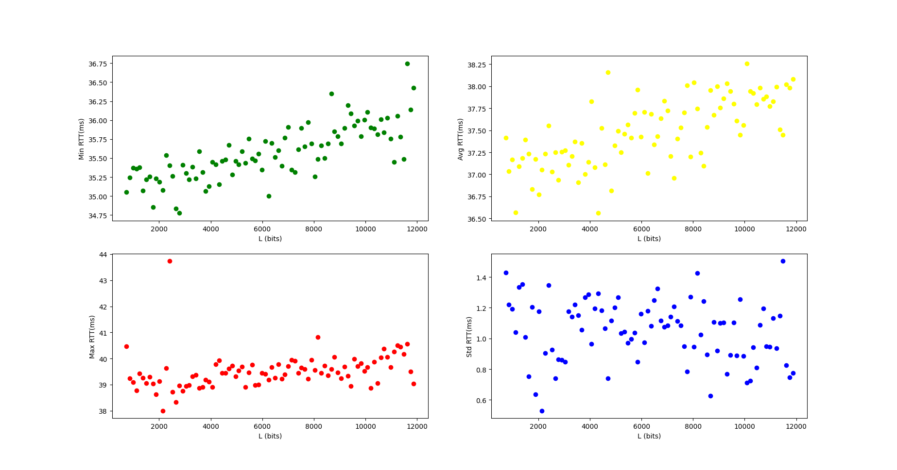

## Project choises

The project contains two main folders:

- 'src' folder for all the source code.
- 'output' folder for _.txt_ files that contains the **ping** command output for each ip address inserted in the program.

## NetPerf

This project is written in python because this language provides useful modules such as matplotlib, numpy and pingparsing. These modules are used to manage charts, arrays and to parse the output of the ping command. _NetPerf_ is compatible with both Linux and Windows operating system.

### Instruction

Having [GNU Make](https://www.gnu.org/software/make/) for building projects will simplify the execution of the program. Otherwise it is possible to run the program manually.
This project requires some modules as previously stated. First of all [pip](https://www.python.org/downloads/) module installer for python needs to be installed and added to the PATH. On linux if you have python already install type `sudo apt install python3-pip`.

For windows [psping](https://learn.microsoft.com/en-us/sysinternals/downloads/psping#installation) is required.

#### With Make

```console
$ make install
$ make exe

	# or

$ make all
```

#### Without Make

```console
$ python3 -m pip install pingparsing
$ python3 -m pip install matplotlib
$ python3 -m pip install numpy

$ python3 -B ./src/netperf.py
```

Once the program is running, it will ask to insert the hostname of which the **ping** command is going to run (notice that you can skip this input by simply pressing _Enter_ and the default hostname will be _"lon.speedtest.clouvider.net"_) and if you are in linux it will ask also to decide whether the user wants to run the commands in _sudo_ mode. In windows it is better practise to open the terminal in administrator mode in order to solve authorization problems. Then the program will run some ping commands in sequence and the traceroute command (tracert for windows) to find the correct amount of links crossed. Another ping command is prompted in order to save the output. At the end the program will loop other ping commands with increasing payload of packets each iteration up to 1472 bytes and steps of 16 bytes (number of packets sent is 40 each time).

### Example NetPerf

Considering:

- hostname = 'lon.speedtest.clouvider.net'

##### LINUX

|           Usage           |  Command   | Interval | Number of packs | TTL (Time To Live) | Size of packets |
| :-----------------------: | :--------: | :------: | :-------------: | :----------------: | :-------------: |
|    Finding total hops     |    ping    | -i 0.01  |      -c 1       |        -t n        |      -s 1       |
|  Save the default output  |    ping    | -i 0.01  |      -c 10      |       -t 64        |      -s 64      |
| Loop to get network stats |    ping    | -i 0.01  |      -c 40      |       -t 64        |   -s steps[i]   |
|      Check the links      | traceroute |    /     |        /        |         /          |        /        |

##### WINDOWS

|           Usage           | Command | Interval | Number of packs | TTL (Time To Live) | Size of packets |
| :-----------------------: | :-----: | :------: | :-------------: | :----------------: | :-------------: |
|    Finding total hops     |  ping   |    /     |      -n 1       |        -i n        |      -l 1       |
|  Save the default output  |  ping   |    /     |      -n 10      |       -i 64        |      -l 64      |
| Loop to get network stats | psping  |   -i 0   |      -n 40      |         /          |   -l steps[i]   |
|      Check the links      | tracert |    /     |        /        |         /          |        /        |

---

LINUX

```console
$ make exe

$ python3 -B ./src/netperf.py
$ Insert hostname, skip by pressing enter. The default hostname is
$ 'lon.speedtest.clouvider.net'
$ --> lon.speedtest.clouvider.net
$ IP: 5.180.211.133
$ Sudo (Y/N) Y			// this input is present only in linux

$-------------Finding amount of hops to the host-------------
$ Running command: sudo ping -c 1 -t 30 -s 1 5.180.211.133
$ [sudo] password for dave:
$ Running command: sudo ping -i 0.01 -c 1 -t 29 -s 1 5.180.211.133
$ Running command: sudo ping -i 0.01 -c 1 -t 28 -s 1 5.180.211.133
$ Running command: sudo ping -i 0.01 -c 1 -t 27 -s 1 5.180.211.133
$ Running command: sudo ping -i 0.01 -c 1 -t 26 -s 1 5.180.211.133
$ Running command: sudo ping -i 0.01 -c 1 -t 25 -s 1 5.180.211.133
$ Running command: sudo ping -i 0.01 -c 1 -t 24 -s 1 5.180.211.133
$ Running command: sudo ping -i 0.01 -c 1 -t 23 -s 1 5.180.211.133
$ Running command: sudo ping -i 0.01 -c 1 -t 22 -s 1 5.180.211.133
$ Running command: sudo ping -i 0.01 -c 1 -t 21 -s 1 5.180.211.133
$ Running command: sudo ping -i 0.01 -c 1 -t 20 -s 1 5.180.211.133
$ Running command: sudo ping -i 0.01 -c 1 -t 19 -s 1 5.180.211.133
$ ------------------------------------------------------------
$ Running command: sudo ping -c 10 -t 64 -s 64 5.180.211.133
$ PING 5.180.211.133 (5.180.211.133) 64(92) bytes of data.
$ 72 bytes from 5.180.211.133: icmp_seq=1 ttl=54 time=89.9 ms
$ 72 bytes from 5.180.211.133: icmp_seq=2 ttl=54 time=112 ms
$ 72 bytes from 5.180.211.133: icmp_seq=3 ttl=54 time=36.7 ms
$ 72 bytes from 5.180.211.133: icmp_seq=4 ttl=54 time=53.2 ms
$ 72 bytes from 5.180.211.133: icmp_seq=5 ttl=54 time=73.9 ms
$ 72 bytes from 5.180.211.133: icmp_seq=6 ttl=54 time=55.4 ms
$ 72 bytes from 5.180.211.133: icmp_seq=7 ttl=54 time=118 ms
$ 72 bytes from 5.180.211.133: icmp_seq=8 ttl=54 time=100 ms
$ 72 bytes from 5.180.211.133: icmp_seq=9 ttl=54 time=60.4 ms
$ 72 bytes from 5.180.211.133: icmp_seq=10 ttl=54 time=81.7 ms
$
$ --- 5.180.211.133 ping statistics ---
$ 10 packets transmitted, 10 received, 0% packet loss, time 9019ms
$ rtt min/avg/max/mdev = 36.665/78.131/118.235/25.639 ms
$ ------------------------------------
$ Running command: traceroute 5.180.211.133
$ traceroute to 5.180.211.133 (5.180.211.133), 30 hops max, 60 byte packets
$  1  myfastgate.lan (192.168.1.254)  4.492 ms  4.456 ms  4.445 ms
$  2  10.5.3.124 (10.5.3.124)  28.441 ms  16.458 ms  28.402 ms
$  3  10.5.105.106 (10.5.105.106)  12.125 ms  12.372 ms  16.415 ms
$  4  10.250.137.205 (10.250.137.205)  16.405 ms 10.250.137.201 (10.250.137.201)  16.394 ms  16.384 ms
$  5  10.254.20.41 (10.254.20.41)  23.915 ms  23.905 ms 10.254.20.45 (10.254.20.45)  37.013 ms
$  6  93-63-100-105.ip27.fastwebnet.it (93.63.100.105)  23.884 ms 93-63-100-113.ip27.fastwebnet.it (93.63.100.113)  15.351 ms 93-63-100-61.ip27.fastwebnet.it (93.63.100.61)  15.315 ms
$  7  93-63-100-141.ip27.fastwebnet.it (93.63.100.141)  15.298 ms  20.303 ms 93-63-100-145.ip27.fastwebnet.it (93.63.100.145)  15.481 ms
$  8  i63lgv-005-ae5.bb.ip-plus.net (193.5.122.134)  16.955 ms  16.939 ms  20.570 ms
$  9  i71lzw-015-ae4.bb.ip-plus.net (138.187.129.162)  20.561 ms  20.550 ms  17.244 ms
$ 10  i79zhh-005-ae21.bb.ip-plus.net (138.187.129.75)  17.214 ms  17.203 ms  40.430 ms
$ 11  i79tix-025-ae10.bb.ip-plus.net (138.187.129.174)  40.399 ms  40.382 ms  40.342 ms
$ 12  100ge0-35.core2.zrh3.he.net (72.52.92.130)  40.323 ms  102.601 ms  102.558 ms
$ 13  100ge0-35.core2.gva1.he.net (184.104.193.134)  102.537 ms  102.512 ms *
$ 14  * * *
$ 15  linx-lon1.thn2.peering.clouvider.net (195.66.227.14)  101.388 ms  101.343 ms  101.322 ms
$ 16  * * *
$ 17  h185-42-222-17.reverse.clouvider.net (185.42.222.17)  102.647 ms  102.628 ms *
$ 18  185.245.80.45 (185.245.80.45)  102.521 ms  102.503 ms  102.485 ms
$ 19  185.245.80.1 (185.245.80.1)  98.261 ms  63.026 ms  62.979 ms
$ 20  5.180.211.133 (5.180.211.133)  62.960 ms  62.941 ms 194.35.234.205 (194.35.234.205)  62.917 ms
$ ------------------------------------
$ Route is correct
$ Hops to host: 20
$ Number of links crossed: 40
$ ++++++++++++++++++++++++++++++++++++++++++++
$ Running netperf with packets of size 512 bits
$ Running command: sudo ping -i 0.01 -c 40 -t 64 -s 64 5.180.211.133

	// ... iteration of the ping command to get the network stats
```

### Results

In the previous example the number of links crossed is 40, and it is verified by the _traceroute_ or _tracert_ command.
The RTT data collected from the last part of the program is displayable in these graphs:

Linux:


Windows:


From min-RTT graph we can use the **numpy.polyfit** method to get the slope of the function. We can call this coefficient _'a'_ (notice that _'a'_ has to be converted from _ms/bit_ to _s/bit_).
This slope is used to estimate the value of the _throughput_ and the _throughput bottleneck_ with the following formulas:

$$ S = \frac{n\\_{links}}{a} $$
$$ S\\_{bottleneck} = \frac{2}{a} $$

In this specific example the value of the throughputs are:

- Linux:
  $$ S = 461975685.89 \: bits/s $$

  $$ S_b = 23098784.29 \: bits/s $$

- Windows:
  $$ S = 518583799.43 \: bits/s $$

  $$ S_b = 28810211.08 \: bits/s $$

We can see that the throughput is in the order of magnitude of tens of Mbit/s in optimal conditions, meaning that all the links in the connection have the same throughput and the packets queue time in each link is approximately _0s_. If there is a single link which has the lowest throughput among all of the links crossed, it works as a bottleneck limiting the thoughput (notice that this link as to be considered two times because the packets usually need to return through the same route).

With **numpy.polyfit** we can also estimate the time of propagation _T_ of the signal through the links.

- Linux:
  $$ T = 35.02 \: ms $$

- Windows:
  $$ T = 36.44 \: ms $$

The time of propagation does not depend from the network speed but from the actual speed of the propagation of the signal, so it is governed by physics laws that prevents the signal from being faster than speed of light. If we ping to an host located in America the minimum time of propagation is around _120 ms_, otherwise if we ping to an host located in Europe the _T_ can be close to _30 ms_ or less. Notice that this time depends also on the type of connection, wired connection performs better.
